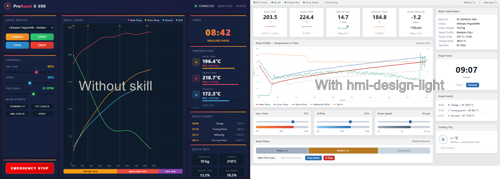
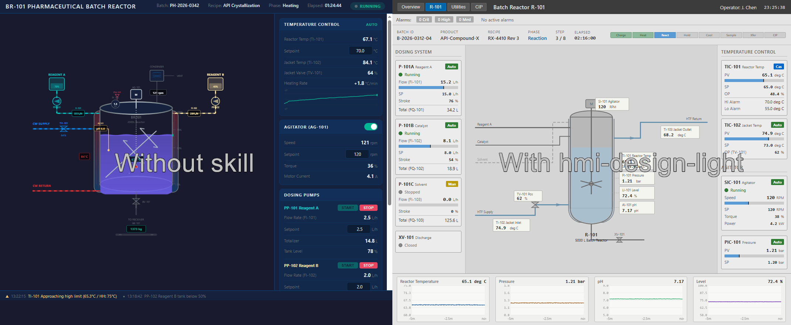
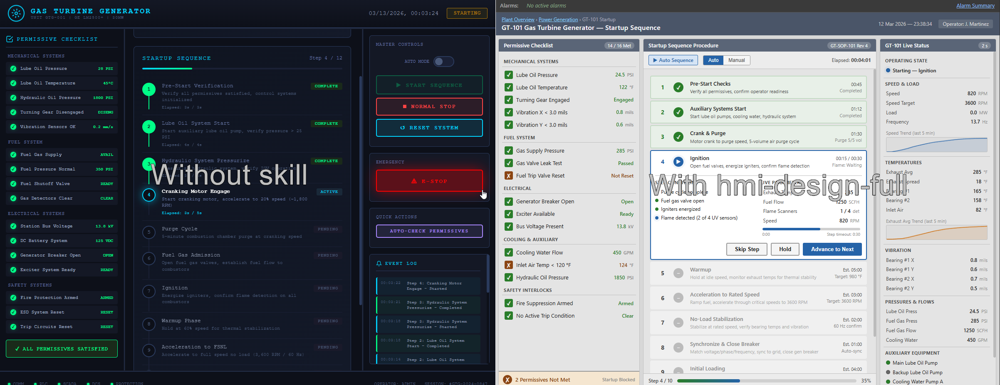

# hmi-design

HMI design skill for AI coding agents. Guides AI to design Human Machine Interfaces that follow industrial process automation standards such as ISA-101 and human factors engineering principles.

## Variants

This skill is available in two variants. Install the one that fits your needs.

### hmi-design-light - Single File

Self-contained skill with core rules in one `SKILL.md`. No additional reference files. Sufficient for most HMI design and review tasks.

**Best for: Quick HMI reviews, generating displays with standard rules, developers that want minimal context window usage.**

### hmi-design-full - Comprehensive Reference

Same core rules plus seven detailed reference files covering color design, display hierarchy, navigation, alarms, human factors, performance, and lifecycle management. The agent loads reference files on-demand as needed.

**Best for: Full system design, detailed alarm philosophy, comprehensive HMI audits, teams building complete HMI systems.**

```
hmi-design-full/
  SKILL.md                                          # Core rules + reference table
  references/
    color-and-visual-design.md                      # Colors, backgrounds, typography, density
    display-hierarchy-and-styles.md                 # 4-level hierarchy, display types, layouts
    navigation-and-interaction.md                   # Navigation, data entry, buttons, security
    alarm-design.md                                 # Alarm states, sounds, placement, summaries
    situation-awareness-and-human-factors.md        # Cognitive load, SA model, HFE principles
    performance-requirements.md                     # Call-up times, refresh rates, stress testing
    lifecycle-and-management.md                     # Lifecycle stages, MOC, audits, user types
```

## Installation

hmi-design skill follows the open [Agent Skills](https://agentskills.io/) standard. Simply copy the skill folders into your skills directory and your AI agent will automatically discover and use them.

### Step 1: Clone the repository

```bash
git clone https://github.com/timhok/hmi-design.git
```

### Step 2: Copy light or full variant to your skills directory

Copy preferred skill folder from `hmi-design/` to one of the supported skill directories below. You can install skills **globally** (available across all projects) or **per-project** (available only in that project).

**Global installation** (recommended - skills available everywhere):

| Tool | Directory |
|------|-----------|
| Cursor | `~/.cursor/skills/` |
| Claude Code | `~/.claude/skills/` |
| Codex | `~/.codex/skills/` |
| Gemini CLI | `~/.gemini/skills/` |

**Project-level installation** (skills scoped to a single project):

| Tool | Directory |
|------|-----------|
| Cursor | `.cursor/skills/` (in your project root) |
| Claude Code | `.claude/skills/` (in your project root) |
| Codex | `.codex/skills/` (in your project root) |
| Gemini CLI | `.gemini/skills/` (in your project root) |

> **Note:** Cursor also reads from `.claude/skills/`, `.codex/skills/`, and `.gemini/skills/` directories, and vice versa, so skills are cross-compatible between tools.

**Example - global light version install for Cursor:**
```bash
cp -r hmi-design/hmi-design-light ~/.cursor/skills/
```

**Example - global light version install for Claude Code:**
```bash
cp -r hmi-design/hmi-design-light ~/.claude/skills/
```

**Example - global light version install for Gemini CLI:**
```bash
cp -r hmi-design/hmi-design-light ~/.gemini/skills/
```

**Example - project-level full version install:**
```bash
mkdir -p .cursor/skills
cp -r /path/to/hmi-design/hmi-design-full .cursor/skills/
```

Your AI agent will automatically discover the skill and use it when its relevant to your task. You can also invoke skill manually by mentioning the skill name in your prompt.

## Examples

All examples were made with "Claude Code Opus 4.6":

Prompt: `Create mock dashboard for controlling production-scale coffe roaster in a single html file`


Prompt: `Create a control display for a pharmaceutical batch reactor with jacket heating, agitator, and dosing pumps in html`


Prompt: `Design a startup sequence display for a gas turbine generator with permissive checklist and step-by-step procedural controls in html`


## P.S.

Honestly, i dont see any issue of using this skill for anything outside of industrial automation field, the result still looks professional and nice to work with, thats why i created this skill.

## References

- **ISA-101**: Human Machine Interfaces for Process Automation Systems
- **Human Factors Engineering** principles for industrial control rooms
- **ISA/IEC 62443** security concepts for industrial automation

## License

This project is licensed under the **MIT License**, its provided "as is" without warranty of any kind